# STMockup - Stock Market Social Platform Mockup

A modern, high-fidelity mockup of a stock market social platform built with React, Vite, and Tailwind CSS. This project demonstrates complex UI patterns, gated content states, and real-time-like data visualizations.

## 🚀 Getting Started

1.  **Clone the repository**
2.  **Install dependencies**:
    ```bash
    npm install
    ```
3.  **Run the development server**:
    ```bash
    npm run dev
    ```

## 📐 Project Map

The following diagram illustrates the application's route structure and component composition:

```mermaid
flowchart TD
    Root["/"] -->|redirects| Registered["/registered"]
    
    Root --> Home["/home<br/>(Home Page)"]
    Root --> Registered
    Root --> Unreg["/unreg<br/>(Unregistered Dashboard)"]
    Root --> NewPage["/newpage<br/>(Experimental Layout)"]
    
    Registered --> Dashboard["Dashboard Component<br/>(isUnregistered=false)"]
    Unreg --> DashboardUnreg["Dashboard Component<br/>(isUnregistered=true)"]
    
    subgraph SharedComponents["Shared Components"]
        LeftSidebar["LeftSidebar<br/>(Navigation & Watchlist)"]
        TopNav["TopNavigation<br/>(Search & Tabs)"]
        TickerTape["TickerTape<br/>(Scrolling Market Data)"]
        StockHeader["CollapsibleStockHeader<br/>(Stock Details)"]
        WhatsHappening["WhatsHappening<br/>(Live Events & News)"]
        DynamicThemes["DynamicThemes<br/>(Content Filtering)"]
        Community["Community<br/>(Community Spotlight)"]
        PredictionLB["PredictionLeaderboard<br/>(Predictions Ranking)"]
        MessageBox["MessagePostBox<br/>(Post Creation)"]
        Poll["Poll<br/>(Interactive Polls)"]
        NarrativeTL["NarrativeTimeline<br/>(Chronological View)"]
    end
    
    Home --> LeftSidebar
    
    Dashboard --> LeftSidebar
    Dashboard --> TopNav
    Dashboard --> TickerTape
    Dashboard --> StockHeader
    Dashboard --> WhatsHappening
    Dashboard --> DynamicThemes
    Dashboard --> Community
    Dashboard --> PredictionLB
    Dashboard --> MessageBox
    Dashboard --> Poll
    
    DashboardUnreg --> LeftSidebar
    DashboardUnreg --> TopNav
    DashboardUnreg --> TickerTape
    DashboardUnreg --> StockHeader
    DashboardUnreg --> WhatsHappening
    DashboardUnreg --> DynamicThemes
    DashboardUnreg --> Community
    DashboardUnreg --> PredictionLB
    DashboardUnreg --> MessageBox
    
    NewPage --> LeftSidebar
    NewPage --> TopNav
    NewPage --> TickerTape
    NewPage --> StockHeader
    NewPage --> DynamicThemes
    NewPage --> WhatsHappening
    NewPage --> PredictionLB
    NewPage --> NarrativeTL
    
    style Root fill:#e1f5ff
    style Home fill:#fff4e1
    style Registered fill:#e8f5e9
    style Unreg fill:#fff3e0
    style NewPage fill:#f3e5f5
    style Dashboard fill:#e8f5e9
    style DashboardUnreg fill:#fff3e0
```



### Component Usage Summary

- **`/home`**: Uses `LeftSidebar` for navigation. Features custom carousels for trending symbols, topics, and earnings calls.
- **`/registered`** & **`/unreg`**: Both use the `Dashboard` component with different authentication states. Share: `LeftSidebar`, `TopNavigation`, `TickerTape`, `CollapsibleStockHeader`, `WhatsHappening`, `DynamicThemes`, `Community`, `PredictionLeaderboard`, `MessagePostBox`. The unregistered version gates some content with `SoftGate` and `HardGate` components.
- **`/newpage`**: Experimental layout sharing most dashboard components plus `NarrativeTimeline` for chronological content display.

## 🗺️ Page Routes & Features

The application is structured around several key routes, each demonstrating different states and layouts:

### 🏠 Home (`/home`)
The primary landing experience providing a broad market overview.
- **Live Event Stream**: Integrated video player placeholder for live market events.
- **Market Sentiment**: Fear & Greed sentiment meters.
- **Trending Carousels**: Horizontal carousels for Trending Symbols, Trending Topics, and upcoming Earnings Calls grouped by date.

### 📊 Registered Dashboard (`/registered`)
The full, authenticated user experience.
- **Interactive Feed**: Toggle between Latest and Popular posts with poll integration.
- **Stock Header**: Collapsible header for specific stocks (e.g., $RKLB) featuring real-time price data, sparklines, and comprehensive market stats.
- **Watchlist Sidebar**: A fixed left sidebar with user profile, notifications, and a real-time watchlist with mini-sparklines.
- **Community Widgets**: Prediction leaderboards, community voices, and latest news.

### 🔒 Unregistered Dashboard (`/unreg`)
A demonstration of "soft-gated" content for prospective users.
- **Gated Elements**: Uses `SoftGate` and `HardGate` components to blur or lock premium features (e.g., full community perspectives, leaderboard, and full news feed).
- **Registration CTAs**: Strategically placed calls-to-action to encourage user sign-up.

### 🆕 Experimental Layout (`/newpage`)
A prototype for an alternative dashboard structure.
- **Narrative Timeline**: A chronological view of market events and community posts.
- **Reorganized Widgets**: Focuses on "What's Happening" and community predictions in a different grid arrangement.

## 🛠️ Core Components

- **`CollapsibleStockHeader`**: A sophisticated header component for ticker-specific data.
- **`DynamicThemes`**: Content filtering system based on market themes like "Fed Decision" or "China Tariffs".
- **`LeftSidebar`**: Fixed navigation with integrated dark mode toggle and watchlist management.
- **`SentimentMeters`**: Visual tools for tracking community and market sentiment.
- **`TickerTape`**: A classic scrolling ticker for broad market indices and watchlist stocks.
- **`MessagePostBox`**: Rich text area for community members to share insights and predictions.

## 🎨 Design System

The project uses a custom design system implemented via Tailwind CSS:
- **Dark Mode**: Fully supported with persistent user preference.
- **Surface System**: Layered background colors (`bg-surface`, `bg-surface-muted`) for depth.
- **Interactive States**: Smooth transitions for hover and pressed states across all buttons and cards.

---

*Note: This is a frontend mockup. Data is currently simulated for demonstration purposes.*
